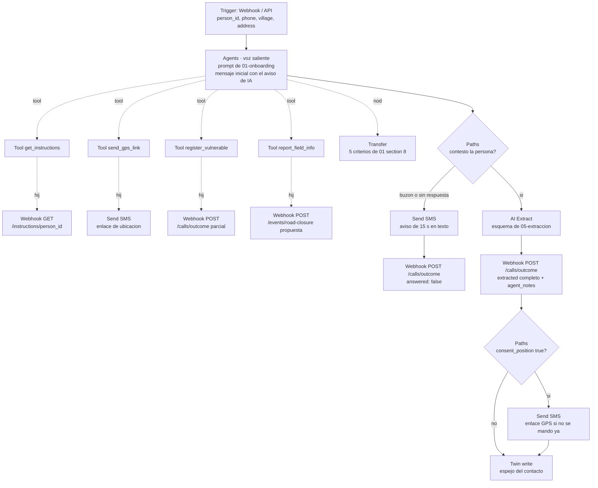
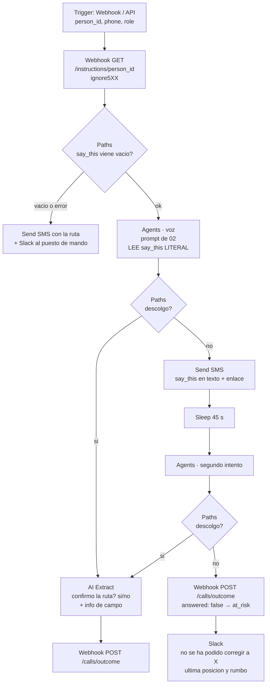
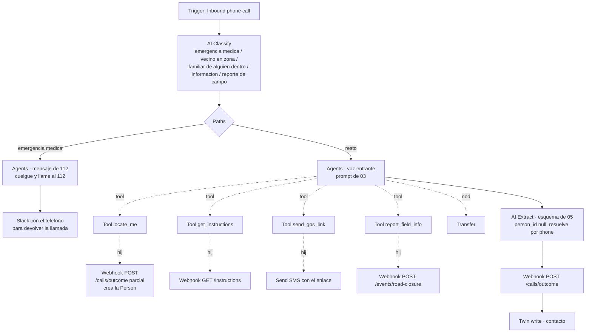
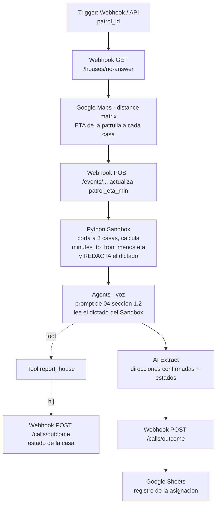
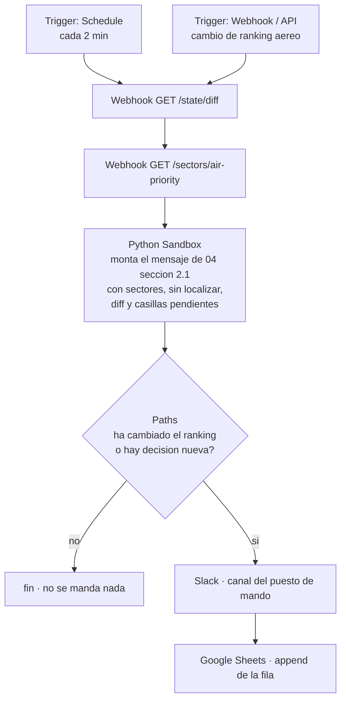

# 06 · Workflows de HappyRobot

> Qué workflows se crean, con qué trigger, y el grafo de nodos de cada uno.
> **Solo se usan nodos que existen** según `docs/02-happyrobot/03-workspace-y-limites-verificados.md` §3 y §4 (recorrido del workspace
> el 18 sep 2026). Al final, §8, va la comprobación nodo por nodo.
> Criterios de rúbrica: **Ejecución fuera del sistema** (todo lo que sale de aquí es una llamada, un SMS o
> un mensaje real) y **Aprendizaje** (§7, Northstars).

## 0. Inventario de nodos permitidos (lo que puedo usar)

| Categoría | Nodos disponibles |
|---|---|
| Triggers | Web call · Inbound phone call · Webhook / API · SMS / WhatsApp · Email · Schedule |
| Agents | **Agents** (voz o texto) con **Tools** hijos |
| AI | **Generate** · **Extract** · **Classify** |
| Built-in | **Webhook GET/POST** · **Python Sandbox** · **Loop** · **Paths** · **Sleep** · **Function Call** · **Send SMS** · **Transfer** |
| Integraciones | **Google Maps** · **Twin** · **Slack** · **Google Sheets** · **Redis** |

Dos límites verificados en `docs/02-happyrobot/04-api-y-sdk.md` que dan forma a todos los grafos de abajo:

1. **El Python Sandbox no tiene red saliente.** Módulos permitidos: `math, datetime, pytz, re, dateutil, random, collections, json, _strptime, time, base64`. Así que el Sandbox sirve para **formatear, ordenar y validar**, nunca para hablar con `api/`. Todo HTTP va por nodos **Webhook GET/POST**.
2. **Una Tool de un Agent no llama a nuestra API por sí misma**: el nodo Tool tiene un **hijo** (normalmente un Webhook GET/POST) que hace la petición con los argumentos que el agente le pasa. Es el patrón de todas las tools de este documento.

Y un tercero, operativo: **no hay callback de fin de run** (el SDK oficial hace polling). Por eso **todos
los workflows terminan en un `Webhook POST` a `api/`**: así nuestro sistema se enrama sin tener que
preguntar.

---

## 1. WF-0 · `disparador-lote` — arrancar la oleada de llamadas

**Trigger:** `Webhook / API`. Lo dispara `engine/` cuando se declara la zona de evacuación.
**Params:** `houses` (lista de `{person_id, house_id, phone, village, address, first_name, vulnerable}`), `wave_id`.

```mermaid
flowchart TD
    T[Trigger: Webhook / API<br/>params: houses[], wave_id] --> S[Python Sandbox<br/>valida y ORDENA la lista<br/>por priority_score descendente]
    S --> L[Loop<br/>sobre cada casa]
    L --> F[Function Call<br/>invoca WF-1 llamada-onboarding]
    F --> L
    L --> P[Webhook POST<br/>/calls/started por lote<br/>wave lanzada]
```

**Por qué un `Function Call` dentro del `Loop` y no el Agent directamente en el bucle:** con `Function Call`
cada llamada es **un run propio** en la pestaña Runs. Eso da transcripción, logs y —lo importante—
**Northstars por llamada**. Si las 30 llamadas viven dentro de un solo run, el auditor automático evalúa un
run gigante y el bonus de aprendizaje se queda sin datos utilizables. Un run = una llamada = una unidad de
aprendizaje.

**Por qué el orden lo pone el Sandbox y no el Loop:** el Sandbox recibe la lista ya puntuada por `api/` y
solo la ordena y valida (descarta teléfonos vacíos, deduplica). Es determinista y no necesita red. Poner un
LLM a decidir el orden de llamada sería meter no-determinismo en la única parte del sistema que no lo
necesita: la prioridad ya está calculada, y con su desglose.

> ⚠️ **Plan B si `Loop` no se comporta como esperamos.** `Loop` aparece en el menú "+" del canvas
> (`docs/02-happyrobot/03-workspace-y-limites-verificados.md` §4, marcado [OK]), pero en el catálogo de eventos del SDK que recoge
> `docs/02-happyrobot/04-api-y-sdk.md` no aparece un evento `loop.*` explícito. **PENDIENTE DE CONFIRMAR EN EL
> STAND**: semántica exacta del Loop (paralelismo, límite de iteraciones, qué pasa si una iteración falla).
> Si da problemas, WF-0 se borra y **el fan-out lo hace `engine/`**: un `POST` al webhook de WF-1 por casa.
> Cuesta 10 líneas de Python y elimina la dependencia. Esta es la opción segura si vamos con prisa.

---

## 2. WF-1 · `llamada-onboarding` — la llamada masiva

**Trigger:** `Webhook / API`. **Params:** `person_id`, `phone`, `village`, `address`, `first_name`, `vulnerable`.
**Guion:** `01-onboarding-outbound.md`. **Esquema de extracción:** `05-extraccion.md`.



**Tools del Agent y a qué endpoint nuestro pegan:**

| Tool | Hijo | Endpoint | Para qué |
|---|---|---|---|
| `get_instructions` | Webhook GET | `GET /instructions/{person_id}` | la salida, el convoy y `say_this`. **Sin esta tool el agente no puede decir ni una cifra.** |
| `send_gps_link` | Send SMS | — (SMS de la plataforma) | manda el enlace de `web/gps/` en cuanto hay consentimiento |
| `register_vulnerable` | Webhook POST | `POST /calls/outcome` (parcial) | sube al mapa a una persona encamada **sin esperar a que acabe la llamada** |
| `report_field_info` | Webhook POST | `POST /events/road-closure` | propuesta de corte, que queda pendiente de aprobación humana |

`register_vulnerable` a mitad de llamada, y no en la extracción final, es deliberado: si alguien dice en el
segundo 30 que su madre no puede salir, esa información tiene que estar en el puesto de mando en el segundo
31, no 60 segundos después. **El dato urgente no espera a que la conversación termine.**

`Transfer` no cuelga de un Path del modelo: sus cinco condiciones están escritas en el prompt
(`01-onboarding-outbound.md` §8) precisamente para que no sea el modelo quien decida el criterio.

---

## 3. WF-2 · `reruta-urgente` — la corrección de 20 segundos

**Trigger:** `Webhook / API`, disparado por `api/` cuando el `decision_log` escribe un
`route_recalculated` o un `exit_reassigned`. **Params:** `person_id`, `phone`, `first_name`, `role`.
**Guion:** `02-reruta-urgente.md`.



Dos cosas que hacen de este workflow la prueba del criterio "Adaptación":

- **El `Paths` de `say_this` vacío va antes del Agent.** Si `api/` no ha podido generar la frase, la llamada
  no se hace: se manda SMS y se avisa a un humano. Una llamada de reruta sin ruta es peor que no llamar.
- **El SMS va antes del segundo intento** (`Send SMS` → `Sleep` → `Agents`), no después. Es instantáneo y
  gratis, y alguien conduciendo ve la notificación aunque no descuelgue.

---

## 4. WF-3 · `entrante` — la puerta de la Capa 0

**Trigger:** `Inbound phone call` (número de Telnyx). **Guion:** `03-inbound-es-alert.md`.



El `AI Classify` delante del Agent es lo que permite que la **bifurcación cero** (emergencia médica → 112)
ocurra en el primer segundo y sin depender del criterio del agente conversacional. Clasificar antes de
conversar es más barato, más rápido y más auditable.

`locate_me` existe por el problema del §6 de `03`: en una entrante no hay `person_id`, y
`get_instructions` lo necesita. La tool crea la persona en cuanto hay pueblo, devuelve el `person_id`, y
solo entonces el agente puede pedir instrucciones.

---

## 5. WF-4 · `aviso-patrulla` y WF-5 · `parte-al-mando`

### WF-4 · `aviso-patrulla` — Webhook / API



**El texto que la patrulla oye lo redacta el Python Sandbox, no un LLM.** Es la decisión técnica de la que
estoy más convencido de todo el documento: el dictado son direcciones y números, el formato es fijo
(`04-patrulla-y-mando.md` §1.3) y el Sandbox hace `f-strings` de forma determinista. Un `AI Generate` ahí
podría redondear "dieciocho minutos" a "unos veinte", y esa es exactamente la clase de error que este
proyecto no se puede permitir. El Agent solo pone la voz y recoge la lectura de vuelta.

Google Maps aporta el `patrol_eta_min` real por carretera, que es la mitad de la resta que ordena la lista.
Si la integración no está conectada a tiempo, `api/` usa distancia en línea recta y se dice en la demo.

### WF-5 · `parte-al-mando` — Schedule + Webhook



El `Paths` que corta cuando no ha cambiado nada es antispam y es una decisión de producto: un puesto de
mando que recibe 40 mensajes deja de leer el 41, y entonces el sistema se ha quedado sin supervisión humana
aunque técnicamente la tenga.

---

## 6. WF-6 · `web-call-demo` (y WF-7 opcional)

### WF-6 · `web-call-demo` — Web call

Idéntico a WF-1 salvo el trigger: `Web call` en vez de `Webhook / API`, y los datos de la casa llegan como
variables del run que el dashboard pasa al abrir la llamada. **Es el workflow que usa el jurado**
(`07-guion-demo.md`) y el que se demuestra en directo si no hay número de teléfono. Se mantiene como
workflow aparte, y no como un Path dentro de WF-1, para poder publicarlo y forkearlo sin tocar el de
producción.

### WF-7 · `sms-entrante` — SMS / WhatsApp · **solo si sobra tiempo**

`Trigger SMS/WhatsApp` → `AI Classify` (¿es una posición? ¿un reporte? ¿un "ya estoy fuera"?) →
`Paths` → `Webhook POST` al endpoint que toque. Aporta un canal más al criterio "Coordinación" por muy poco
trabajo, pero **depende de tener número**, así que no está en el camino crítico.

---

## 7. Northstars (el bonus de aprendizaje, sin inventar nada)

Los Northstars son criterios que un auditor automático evalúa **en cada run**
(`docs/02-happyrobot/03-workspace-y-limites-verificados.md` §8). Con la API de feedback (−2..+2) y el pulgar arriba en una observación
de auditoría —que añade el caso como ejemplo positivo, según `docs/02-happyrobot/04-api-y-sdk.md`— se cierra un
bucle real: **cada oleada de llamadas deja el guion mejor que la anterior**, y eso se puede enseñar en
pantalla con dos ejecuciones.

### WF-1 · onboarding

| # | Northstar (binario) | Por qué es este y no otro |
|---|---|---|
| 1 | ¿Se identificó como IA en la primera frase? | Obligación legal (art. 50). Si falla una sola vez, es un problema, no una métrica. |
| 2 | ¿La persona confirmó que sale de casa? | Es el objetivo (a). El único que no se sacrifica. |
| 3 | ¿Se consiguió una respuesta explícita (sí o no) al permiso de ubicación? | Mide que se **preguntó bien**, no que dijeran sí. Un Northstar de "consiguió el sí" premiaría insistir, que es justo lo que no queremos. |
| 4 | ¿Preguntó por los vecinos? | Es la Capa 2 entera. Se mide la pregunta, no la cosecha. |
| 5 | ¿Dijo alguna cifra, hora o carretera que no viniera de una tool? | **Invertido: lo bueno es "no".** El Northstar más importante del sistema. |
| 6 | ¿Duró menos de 120 segundos? | El coste de oportunidad son las casas sin llamar. |
| 7 | ¿Ofreció una alternativa a quien se negó (vecino o rellamada)? | Solo se evalúa en runs con `will_evacuate: false`. |
| 8 | ¿Registró a los vulnerables mencionados? | Detecta dato dicho y perdido. |
| 9 | ¿Aceptó el "no" a la ubicación a la primera, sin insistir? | Protege la validez del consentimiento. |

### WF-2 · reruta

| # | Northstar |
|---|---|
| 10 | **¿El texto dicho coincide literalmente con `say_this`, sin añadidos?** |
| 11 | ¿Pidió y obtuvo la lectura de vuelta de la ruta? |
| 12 | ¿Duró menos de 30 segundos? |

### WF-3 · entrante

| # | Northstar |
|---|---|
| 13 | ¿Consiguió al menos el pueblo? |
| 14 | ¿Derivó al 112 cuando había un herido o alguien atrapado? |
| 15 | ¿Evitó inventar una calle o un número de portal? |

### WF-4 y WF-5

| # | Northstar |
|---|---|
| 16 | ¿Dictó como máximo 3 direcciones y pidió lectura de vuelta? |
| 17 | ¿Dijo en voz alta las casas descartadas por tiempo, con su motivo? |
| 18 | ¿El parte al mando dice "propuesta" y no "he asignado"? |

> **PENDIENTE DE CONFIRMAR EN EL STAND**: si un Northstar puede comparar la transcripción con un valor de
> variable del run (necesario para el #10, que es el que más nos importa). Si no se puede, el #10 se
> implementa fuera: `api/` guarda el `say_this` que emitió y lo compara con `transcript_url` en un test del
> repo. El criterio no se abandona; cambia de sitio.

---

## 8. Comprobación: todos los nodos usados existen

Cotejo contra `docs/02-happyrobot/03-workspace-y-limites-verificados.md` §3 (triggers) y §4 (nodos).

| Nodo / trigger usado | Dónde | ¿Consta en el doc? |
|---|---|---|
| Trigger `Webhook / API` | WF-0, 1, 2, 4, 5 | ✅ §3 |
| Trigger `Inbound phone call` | WF-3 | ✅ §3 |
| Trigger `Web call` | WF-6 | ✅ §3 [OK] |
| Trigger `Schedule` | WF-5 | ✅ §3 |
| Trigger `SMS / WhatsApp` | WF-7 | ✅ §3 |
| `Agents` + `Tools` hijos | WF-1, 2, 3, 4, 6 | ✅ §4 |
| `AI Extract` | WF-1, 2, 3, 4 | ✅ §4 |
| `AI Classify` | WF-3, 7 | ✅ §4 |
| `AI Generate` | **no se usa** | ✅ (consta, pero se descarta a propósito: §5) |
| `Webhook GET` / `Webhook POST` | todos | ✅ §4 |
| `Python Sandbox` | WF-0, 4, 5 | ✅ §4 |
| `Loop` | WF-0 | ⚠️ ✅ §4, pero sin evento `loop.*` en el SDK → plan B en §1 |
| `Paths` | WF-1, 2, 3, 5 | ✅ §4 |
| `Sleep` | WF-2 | ✅ §4 |
| `Function Call` | WF-0 | ✅ §4 |
| `Send SMS` | WF-1, 2, 3 | ✅ §4 |
| `Transfer` | WF-1, 3 | ✅ §4 |
| `Google Maps` | WF-4 | ✅ §4 (integración, **0 conectadas** hoy → hay que conectarla) |
| `Twin` (write) | WF-1, 3 | ✅ §4 (idem) |
| `Slack` | WF-2, 3, 5 | ✅ §4 (idem) |
| `Google Sheets` | WF-4, 5 | ✅ §4 (idem) |
| `Redis` | **no se usa** | ✅ consta; no hace falta, el estado vive en `api/` |
| Northstars | §7 | ✅ §2 y §8 |

**Resultado: ningún nodo inventado.** Todo lo que aparece en los grafos está en el catálogo del workspace.

Cosas que **he nombrado y NO son nodos**, para que nadie las busque en el menú "+":
- **Approval Process** es una **pestaña del workflow**, no un nodo, y la investigación del SDK
  (`docs/02-happyrobot/04-api-y-sdk.md`) **no encontró nodo ni API** para él: probablemente es gobernanza de
  versiones publicadas, no aprobación de decisiones en runtime. **PENDIENTE DE CONFIRMAR EN EL STAND.** La
  aprobación humana de decisiones operativas la implementa **nuestro** dashboard con
  `POST /human/approve`, que es donde tiene que estar.
- **Experiments**, **Signals**, **Audits**, **Tests** son pestañas de observabilidad, tampoco nodos.

---

## 9. Prerrequisitos de plataforma (sin esto no arranca nada)

1. **Túnel público** (`PUBLIC_BASE_URL`, ngrok o cloudflared) para que los nodos Webhook alcancen nuestra `api/` en el portátil. Es el punto de fallo número uno de la integración.
2. **Auth**: nuestra API pide header `x-api-key` = `HR_SHARED_SECRET`. En los nodos Webhook hay que configurar la autenticación por API key (`authType: apiKey` según la investigación del SDK).
3. **Integraciones a conectar**: Slack, Google Sheets y Google Maps están disponibles pero con **0 conectadas** (§1 del doc de plataforma). Hay que hacer el OAuth de cada una. Si falla el Slack, el parte al mando se enseña en el dashboard: no es camino crítico.
4. **Número de teléfono** (Telnyx, España disponible, 0,80 $): **hace falta para WF-3 y WF-7**, no para el resto. Sin número, la demo va por Web call.
5. **Créditos**: ~24/min de voz. 30 llamadas de 90 s ≈ 1.080 créditos por oleada. **PENDIENTE DE CONFIRMAR EN EL STAND**: cuántos créditos tiene la cuenta. Hay que saberlo antes de lanzar una oleada de 30, o se gasta el presupuesto en un ensayo.
6. **`ALLOW_REAL_CALLS=false` por defecto** (contrato §6.3). Los teléfonos del dataset son `+3460099xxxx`. El día de la demo, solo el número del jurado es real.

## 10. Qué puede salir mal

| Riesgo | Mitigación |
|---|---|
| El túnel se cae y los webhooks fallan | `ignore5XX` en los nodos no críticos; el agente tiene frase de repuesto para cada tool; y el dashboard muestra el estado del túnel. |
| `Loop` no hace lo que creemos | Plan B: fan-out desde `engine/`. 10 líneas. |
| Una integración (Slack/Maps) no se conecta a tiempo | Ninguna está en el camino crítico de la llamada. Slack → dashboard; Maps → distancia recta declarada en voz alta. |
| Los créditos se agotan en los ensayos | Ensayar con 3 casas, no con 30. Lanzar la oleada completa solo en la demo. |
| El publicar/forkear rompe la URL del webhook | Cada entorno (Dev/Staging/Prod) tiene su URL. Fijar **Development** en `.env` y no cambiar de entorno el día de la demo. |
| Una llamada real a un número real por error | `ALLOW_REAL_CALLS` + rango sintético + revisar el payload de WF-0 antes de disparar. |
